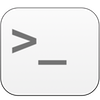

<p align="center">
  
</p>

It's frequently handy to switch back and forth between looking at a folder's contents graphically, and running command-line utilities in it. You can switch from command-line mode to graphical mode with a simple `open .` to view your shell's current working directory in Finder, but the reverse isn't as simple.

Except now it is: after installing this app as a Finder toolbar button, you can click the icon in (just about) any Finder window to open the current folder in a new Terminal window. Or you can hold the **fn** key down to open the folder in a new Terminal tab.


## Installation & Setup


### Step 1: Download the files

Either click GitHub's **Clone or download > Download ZIP** button above to download open-in-terminal-master.zip, unzip it, and drag the resulting folder to somewhere convenient, such as `~/AppleScripts`, or clone with Git:

```bash
git clone https://github.com/jakshin/open-in-terminal.git
```


### Step 2: Build the application

Open a Terminal window in the folder which contains `Open In Terminal.applescript`, and run the following command:

```bash
./build.sh
```

This will create `Open In Terminal.app`.

A command-line utility named `modifier-keys` is incorporated into the application's bundle. The application uses it to determine which modifier keys are pressed as it is launched. The compiled binary is included in Git; if you'd like to recompile it from its C source yourself, you'll need to [install Xcode's command-line tools](https://developer.apple.com/library/ios/technotes/tn2339/_index.html), then run `make` in the `modifier-keys` folder.


### Step 3: Drag the application into your Finder toolbar

Hold the **command** key down and drag `Open In Terminal.app` into your Finder toolbar:

![[screenshot]](Screenshots/Drag-Icon.png)


Now you can open any Finder window's current folder in a new Terminal window just by clicking the application's icon in your Finder toolbar.


## Uninstallation

To uninstall the app, hold the **command** key down and drag its icon out of your Finder toolbar, then delete it.
