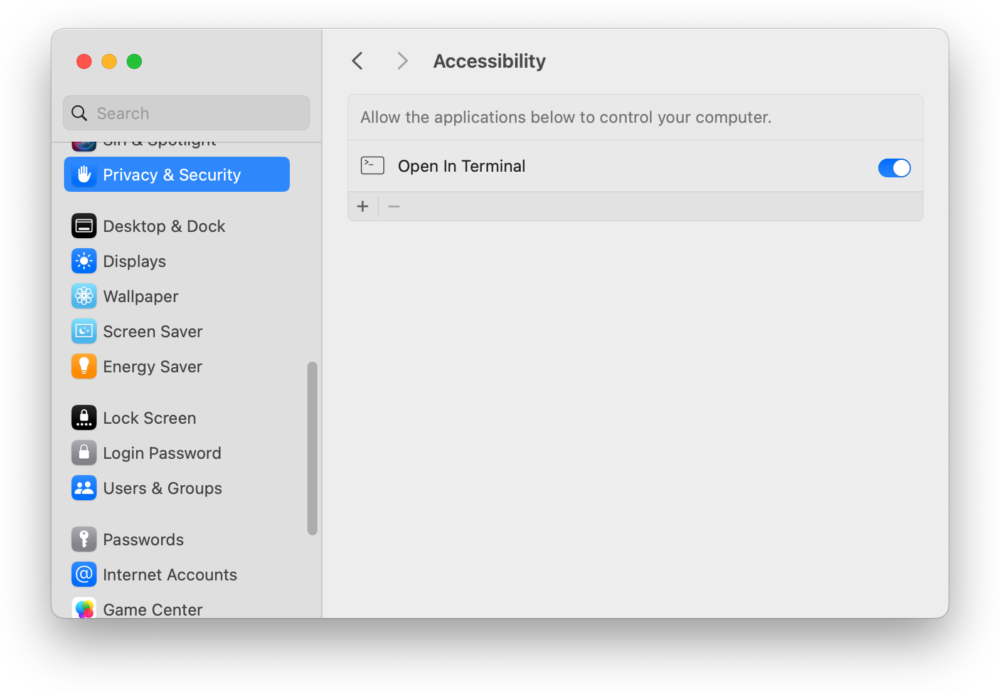
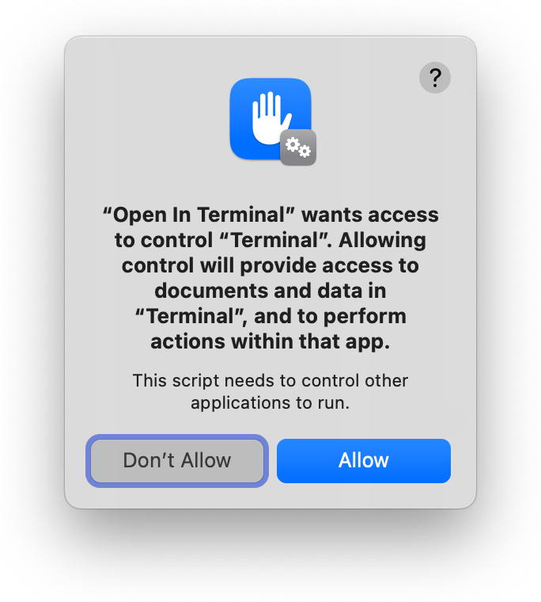
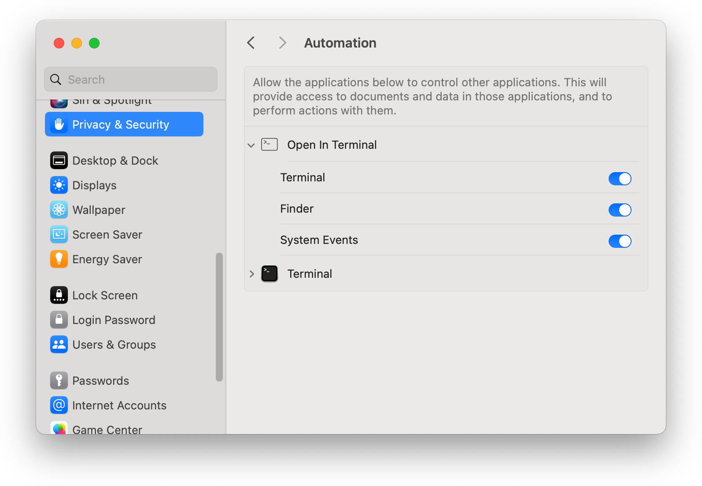

It's often handy to switch between looking at a folder's contents in Finder, and running command-line utilities in it. You can switch from command line to GUI by running `open .` to view your shell's working directory in Finder, but the reverse isn't as easy.

*Except now it is!* After installing this app as a Finder toolbar button, you can click its icon in (just about) any Finder window to open a new Terminal window, with your shell's working directory automatically switched to the Finder window's folder. Or you can hold the **fn** or **shift** key down as you click, to open the folder in a new Terminal tab, instead of a new window.

If you prefer [iTerm](https://iterm2.com) to Apple's Terminal, see [Open in iTerm](https://github.com/jakshin/open-in-iterm).


## Installation

### Step 1: Get the code and build the app

Either clone the repo, or download it and extract the zip file.   
Then run `build.sh`, which will create `Open In Terminal.app`.

The build script tries to detect whether you have macOS's dark mode enabled, to decide which icon to build the app with, so you may see a popup asking to grant Terminal access to control System Events. If you say no (or if you've previously declined to grant Terminal this access), the build script will use the light-mode icon by default. You can pass the `--dark` or `--light` option to the build script to manually select an icon, avoiding the need for the script to try to detect dark mode.

<div align="center">
	
</div>

### Step 2: Allow assistive access

Open **System Settings**, and navigate to **Privacy & Security > Accessibility**. Drag `Open In Terminal.app` into the right-hand section of the System Settings window, and ensure that its toggle switch is turned on:

<div align="center">
	
</div>

If you skip this step, you may receive an error that "Open In Terminal is not allowed assistive access" when you attempt to use the app.

### Step 3: Allow automation access

Launch the app for the first time. You'll see a series of popups asking to grant it access to control Finder, System Events, and Terminal. You'll need to allow each, or Open In Terminal won't be able to do its thing:

<div align="center">
	
	
	
</div>

If you accidentally don't allow access to any of these apps, you can fix it in **System Settings**, on the **Privacy & Security > Automation** screen:

<div align="center">
	
</div>

### Step 4: Drag the application into your Finder toolbar

Hold the **command** key down and drag `Open In Terminal.app` into your Finder toolbar:

<div align="center">
	
</div>

### Step 5: Install the wrapper script (optional)

The `term` shell script allows launching `Open In Terminal.app` from the command line, and specifying the new shell's working directory instead of getting it from a Finder window. To install it, copy or symlink it in a directory that's in your shell's path, or add the directory it's in to your path. For example, to create a symlink in `/usr/local/bin`, run this from the directory containing the script:

```bash
[[ -d /usr/local/bin ]] || sudo mkdir -p /usr/local/bin
sudo ln -s "$(pwd -P)/term" /usr/local/bin/term
```


## Uninstallation

To uninstall the app, hold the **command** key down and drag its icon out of your Finder toolbar, then delete it.

If you installed the command-line `term` wrapper script, delete it and any symlinks to it.
